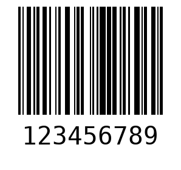

  

Aplicação desenvolvida no NLW Expert da Rocketseat na trilha Python.

  

  <a href="#-tecnologias">Tecnologias</a>&nbsp;&nbsp;&nbsp;|&nbsp;&nbsp;&nbsp;
  <a href="#-projeto">Projeto</a>&nbsp;&nbsp;&nbsp;|&nbsp;&nbsp;&nbsp;
  <a href="#memo-licença">Licença</a>

  

 

  

## 🚀 Tecnologias

Esse projeto foi desenvolvido com as seguintes tecnologias:

- Python: framework Flask.

## 💻 Projeto

Projeto de um Gerador de Código de Barras desenvolvido em Python durante o evento NLW Expert da Rocketseat.

## 📝 Licença

Esse projeto está sob a licença MIT.
